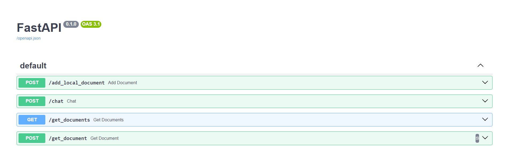

The codebase is built on top of the excellent [RAGMEUP](https://github.com/AI-Commandos/RAGMeUp/tree/main).  
I currently added FastAPI and markdown support. There is more that needs to be added.  
Also this project will only support postgres



# Installation

## Server
#### if you wanna use torch(like huggingfaceEmbedding) and more provenance,you need to uncomment requirements.txt
```bash
# if you need torch
# torch==2.3.1
# langchain-huggingface==0.0.3
# sentence-transformers==2.6.1
# transformers==4.43.1
# accelerate==0.34.0
```
and uncomment provenance.py and RAGHelper.py in the section about provenance
#### make sure you have chroma and data folder under server/rag
#### run the project(better create virtual environment)
```bash
git clone https://github.com/Havlight/drug-lable-rag.git
cd server
pip install -r requirements.txt
```
Then run the server using `python main.py` or `fastapi run` from the server subfolder.

there is a test account:
username:`user@gmail.com`
password:`1111`
## configuration
#### there is a chinese version of `.env` if you wanna use
you can add your api key in `rag/.env`
```bash
GOOGLE_API_KEY=put_your_key-fqxkE4Y
JINA_API_KEY=put_your_key
```
specify embedding model
```bash
embedding_model=jina-embeddings-v2-base-zh
embedding_provider=jina
```
add jwt key in `accounts/.env`
```bash
jwt_key=your_key
```
